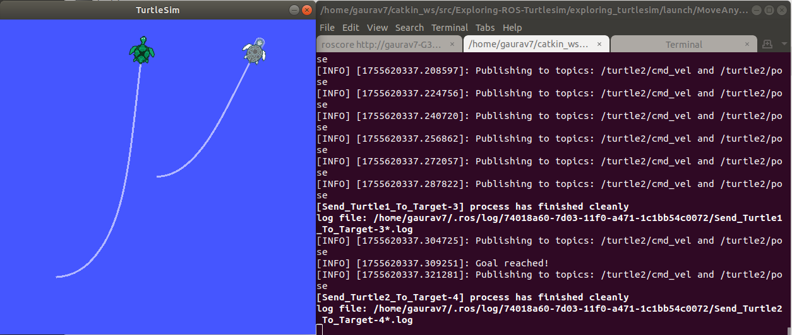

# Exploring-ROS-Turtlesim

## **Task 1: Sending Turtlesim Turtle to user-defined coordinates**

**Files Used:**
1. `MoveTurtleToTarget.py`: Node to send the turtle to a user defined location.
2. `SendTurtleToTarget.launch`: Launch file to launch the turtlesim and the "MoveTurtleToTarget.py" node. 

Command to see the code in action:

```shell
roslaunch exploring_turtlesim SendTurtleToTarget.launch
```

The image below shows the output for task 1:


## **Task 2: Spawn multiple Turtlesim turtles in the same screen**

**Files Used:**
1. `SpawnAdditionalTurtes.py`: Node to connect to '/spawn' service hosted by turtlesim. 
2. `LaunchMultipleTurtles.launch`: Launch file to launch the turtlesim and "SpawnAdditionalTurtes.py" node.

Command to see the code in action:

```shell
roslaunch exploring_turtlesim LaunchMultipleTurtles.launch
```

The image below shows the output for task 2:


The turtlesim hosts a service named '/spawn'. This service accepts the orientation and name as the request and then spawns a turtle at those coordinates and orientation with the name. This new turtle will be spawned at the same simulator screen. Different set of topics are assigned to different turtles and they can be controlled independently. The topics can be checked using the `rostopic list` command on another terminal tab. The list of topics will be visible as shown below:


Here, it is visible that the 'turtle1' and 'turtle2' are assigned same topics separately. We can publish commands to different topics and make them work independently. We are passing the initial spawning coordinates of the second turtle through the launch file as parameters. To change the spawning coordinates the parameters' values can be updated in the launch file. 


## **Task 3: Send different turtles to different target location**

In this task we need to implement the spawning of two different turtlesim bots in the same window and control them simultaneously and independently and send them to desired coordinates passed by the user. 

**Files Used:**
1. `MoveAnyTurtleToTarget.py`: Node that navigates a single turtle at one time to the desired target location. 
2. `MoveAnyTurtleToTarget.launch`: Launch file to spawn two turtles and help them navigate independently using the `MoveAnyTurtleToTarget.py` script.

Command to see the code in action:

```shell
roslaunch exploring_turtlesim MoveAnyTurtleToTarget.launch
```

The image below shows the output for task 3:



Here, we have parameterized the topic names for the script 'MoveAnyTurtleToTarget.py'. We are passing different topics' names for turtle1 and turtle2 as parameters in the launch file named 'MoveAnyTurtleToTarget.launch'. This ensures that both the turtles are handled independently.