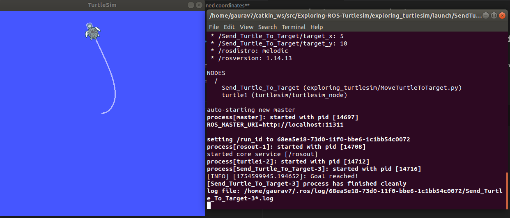
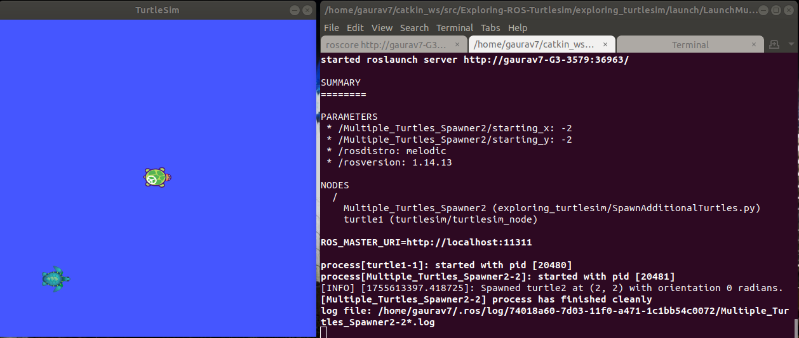
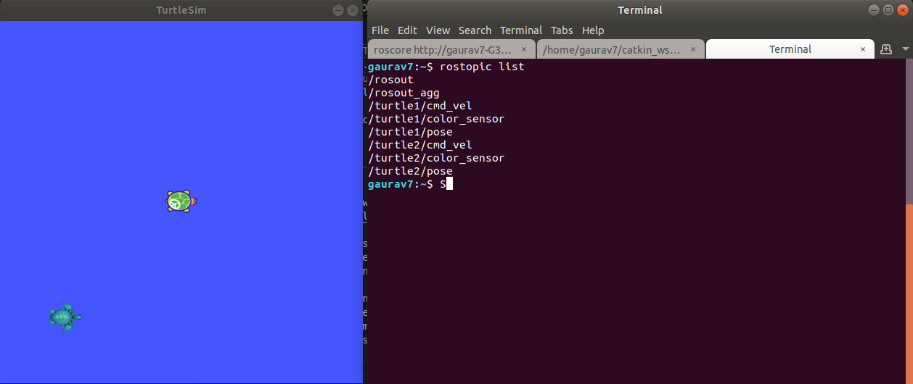

# Exploring-ROS-Turtlesim

## **Task 1: Sending Turtlesim Turtle to user-defined coordinates**

**Files Used:**
1. `MoveTurtleToTarget.py`: Node to send the turtle to a user defined location.
2. `SendTurtleToTarget.launch`: Launch file to launch the turtlesim and the "MoveTurtleToTarget.py" node. 

Command to see the code in action:

```shell
roslaunch exploring_turtlesim SendTurtleToTarget.launch
```

The image below shows the output for task 1:




## **Task 2: Spawn multiple Turtlesim turtles in the same screen**

**Files Used:**
1. `SpawnAdditionalTurtes.py`: Node to connect to '/spawn' service hosted by turtlesim. 
2. `LaunchMultipleTurtles.launch`: Launch file to launch the turtlesim and "SpawnAdditionalTurtes.py" node.

Command to see the code in action:

```shell
roslaunch exploring_turtlesim LaunchMultipleTurtles.launch
```

The image below shows the output for task 2:


The turtle sim hosts a service named '/spawn'. This service accepts the orientation and name as the request and then spawns a turtle at that coordinate and orientation with the name. This new turtle will be spawned at the same simulator screen. Different set of topics are assigned to different turtles and they can be controlled independently. The topics can be checked using by running the `rostopic list` command on another terminal tab. The list of topics will be visible as shown below:



Here, it is visible that the 'turtle1' and 'turtle2' are assigned same topics separately. We can publish commands to different topics and make them work independently. 